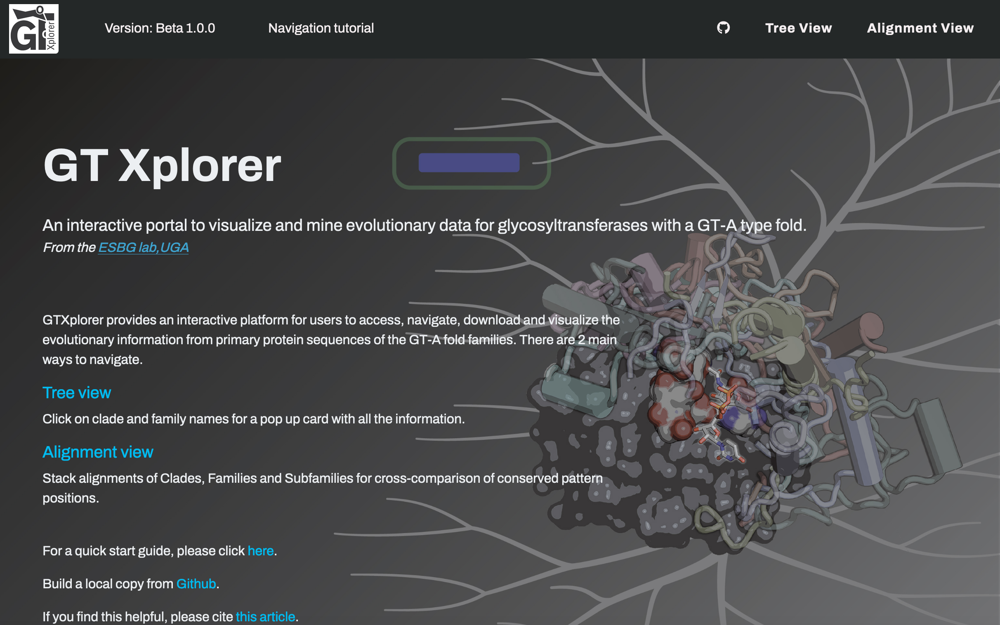

Client 
Server 

# GTXplorer: A portal to navigate and visualize the evolutionary information encoded in fold A glycosyltransferases
This repo includes the GTXplorer web database files and can be downloaded to deploy a local copy of GTXplorer.

---
## Configurations

To change labels, and visibility of the controls, you may edit the `web-react/src/gta.settings.json` file.

------

## Running the Project Locally

1. ### Download this repository to your desired directory 

   ​	by clicking on the green `code` button at the top to download as zip or use the following command:

   ​	`git clone https://github.com/esbgkannan/GTxplorer.git`

2. ### Start the Alignment View server

   1. `cd web-react`
   2. `npm install` (if necessary, run `rm -rf node_modules` before this command)
   3. `npm start` (it starts the server on http://localhost:3000, you can change the port in the `web-react/src/package.json` file).

3. ### Start the GTXplorer project with both tree and alignment view

   1. `cd web`

      (Optional):
      If the local server is running on an address except http://localhost:3000, 

         1. Edit the `src` property value in the following line in `index.html`: 

            `<iframe id="react_frame" src="http://localhost:3000/" width="550" height="550" frameborder="0" scrolling="yes" style="width: 100%">`

         2. Edit the `SERVER_ADDRESS` variable value in `web/src/JS/index.js`

   2. Start the project on a local server:

      `serve -s .`

      Note: If `serve` is not installed. Install it by running `npm install -g serve`.

      Now, you can navigate to `http://localhost:5000/` to view the website.

4. ### (Optional) Download large data files

   ​	Get the data files that are available for download through the web version of GTXplorer using the following script. Run the script from the GTXplorer folder.

   ​	`cd GTxplorer` 

   ​	`bash download.sh`

------

## Tutorial

------

## Description of the data files:

All the complete datasets for GTXplorer are in the [db_files](.web/data/db_files) folder.

#### This folder is organized into the following:

1. ***Fasta***/

   Includes individual files per GTA clade, family and subfamily with all the GTA **domain** sequences for that level.

2. ***FastaFull***/

   Includes individual files per GTA clade, family and subfamily with all the GTA **full length** sequences for that level.

3. ***Tables***/

   Contains tab delimited files with extensive information for all GTA sequences in a given level (clade,family or subfamily).

#### Other directories with relevant data for gtXplorer:

1. ***Domains***/

   For each of the 53 GTA families, this directory contains tables with the domain organization information (one shortened easily readable version and an extended version with more detailed information).

2. ***Tax***/

   This directory includes files with taxonomic distribution information for all GTA clades, families and subfamilies.

3. ***WeblogoDomain***/

   Includes png images of the weblogs for the alignments of sequences from GTA clades, families and subfamilies.

#### Other files:

1. ***Hierarchy.tsv***

   Tab delimited file defining the entire hierarchy of the GTA fold.

2. ***GTA_Tree.csv***

   A csv file for the generation of KinView style viewer.

3. ***GTA_Clade.json***

   Includes details to display in the cards for the 9 major clades.

4. ***GTA_Fam.json***

   Includes details to display for the 53 major GTA families (in the labels of the GTA tree)

5. ***GTA_SubFam.json***

   Incudes details for the GTA subfamilies.

------

## For questions, comments and requests, please contact the ESBG lab at UGA.

Natarajan Kannan: nkannan@uga.edu

Rahil Taujale: rtaujale@uga.edu

------

## Updates

- v1.0.0
  - First packaged beta version.

------

## Citation

If you find this tool helpful, please cite:

Taujale, R., Soleymani, S., Priyadarshi, A., Venkat, A., Yeung, W., Kochut, K.J. and Kannan, N., 2021. GTXplorer: A portal to navigate and visualize the evolutionary information encoded in fold A glycosyltransferases. Glycobiology, 31(11), pp.1472-1477.

------

## Paper

If you want to read the original paper:

https://academic.oup.com/glycob/article/31/11/1472/6330892

------

## License

This work is licensed under the [MIT](./LICENSE) license.
