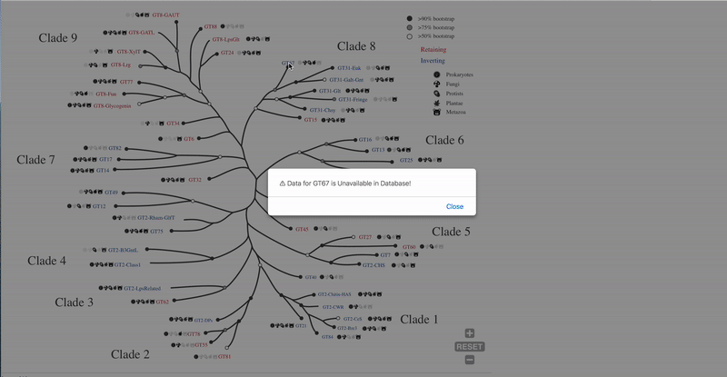

# GTA-Tree
This project includes the gtXplorer web database files.

---

---

---
------

## Description of files in the data directory:

All the complete data for gtXplorer is in the **db_files** folder.

The **db_files** folder is organized into the following

#### 3 json files:

1. ***GTA_Clade.json***

   Includes details to display in the cards for the 9 major clades.

2. ***GTA_Fam.json***

   Includes details to display for the 53 major GTA families (in the labels of the GTA tree)

3. ***GTA_SubFam.json***

   Incudes details for the GTA subfamilies.

#### Directories with downloadable data:

1. ***Fasta***/

   Includes individual files per GTA clade, family and subfamily with all the GTA domain sequences for that level.

2. ***FastaFull***/

   Includes individual files per GTA clade, family and subfamily with all the GTA full length sequences for that level.

3. ***Tables***/

   Contains tab delimited files with extensive information for all GTA sequences in a given level (clade,family or subfamily).

#### Other directories with relevant data for gtXplorer:

1. ***Domains***/

   For each of the 53 GTA families, this directory contains tables with the domain organization information (one shortened easily readable version and an extended version with more detailed information).

2. ***Tax***/

   This directory includes files with taxonomic distribution information for all GTA clades, families and subfamilies.

3. ***WeblogoDomain***/

   Includes png images of the weblogs for the alignments of sequences from GTA clades, families and subfamilies.

#### Other files:

1. ***Hierarchy.tsv***

   Tab delimited file defining the entire hierarchy of the GTA fold.

2. ***GTA_Tree.csv***

   A csv file for the generation of KinView style viewer.

   

------

------

## The following information is only for the test data.

A new version of the GTA tree is in <b>gta_tree_v2.svg</b>.
Currently, data folder includes information for 3 families: <b>GT27, GT64, GT6</b>
A hierarchical listing of all GTA families adn subfamilies are provided in the <b>hierarchy.tsv</b> file.
An example image for displaying family cards: <b>card.png</b>

Scroll down to the header "json" for a short description of how the json file is built.

### downloadables
A link is provided for users to download the files in this folder.

#### DomainExtended/
Contains a table of extended domain information.

#### Fasta/
Contains all the GTA domain sequences in a family.

#### FastaFull/
Contains all the GTA full length sequences in a family.

#### Tables/
Contains extensive information for all the sequences in a family in a tabular format.

### display_images
These images will be displayed in specific sections of the GTA family card.

#### weblogoDomain/
Contains weblogo for the entire family domain. needs to be displayed in the "Family Alginment" section.

### display_tables
This folder contains text information that will be directly shown in the GTA family cards.
All the information from these text files and the image and downloadable folders above have been compiled into family specific json files.

#### json/
Includes one json file for each family in folder json.
Needs to be imported and shown in separate sections of the GTA family card.

An example of how these information can be shown in the cards is provided in an image file: <b>data/card.png</b>

Json file has the following hierarchy:

> GT-Family
>> Description
>>> Note - This will be printed below the description section.
>>> Mechanism - This will be a subsection within the Description section.

>> Subfamilies
>>> Each subfamily will be listed. Links to download the nr and uniprot domain sequence, full sequence and table files need to be provided alongside these files.
>>> Total of 6 files available for download for each subfamily.

>> Domain Organization
>>
>> >This information needs to be show in some form of graphical format. Refer to card.png for a tentative idea.

>> Taxonomy
>>
>> > Information in this section needs to be shown as a table. card.png for a proposed visualization.

>> Family Alignment
>>
>> > This will be a scrollable wide image file with weblogo.

>> Downloads
>>> This section lists all the files available for download for the family. The download links can be made available at different parts of the card.
>>> The extended domain annotation file can be downloaded from the "Domain Organization" section.
>>> Other 6 files (nr and uniprot domain seq, full seq and tables) can be downloaded from some other part of the card. (Either the end or next to the title)

#### Description/
Includes description for each GTA family.

#### Domains/
Includes domain organization information for full length sequences in each family.
This analysis was conducted on the UniProt proteome sequence sets since these sequences are well curated and come from proteome collections. 
The counts for any domain organization reflects counts from the uniprot sequence files.

#### Subfamilies/
Includes a list of subfamilies. Fasta files and tables can be downloaded for each subfamily.

#### Tax/
Includes taxonomic information for each GTA family. 
This analysis was conducted on teh NCBInr database sequences since it provides a more comprehensive coverage of taxonomic groups. 
The counts for each kingdom reflect counts from the nr sequence files. 

===============
# GTA-Tree-kinview
===============

This project is a combination of the [GTA-tree](https://github.com/amitabhpriyadarshi/GTA-Tree/), and [KinView](https://github.com/prokino/kinview/).
The GTA-tree is in the `web` directory, and the merged application resides in the `web-react`.

## Configurations
To change lables, and visibility of the controls, you may edit the `web-react/src/gta.settings.json` file.

## Running the Project Locally
### Server (KinView part)

1. `cd web-react`
2. `npm install` (if necessary, run `rm -rf node_modules` before this command)
2. `npm start` (it starts the server on http://localhost:3000, you can change the port in the `web-react/src/package.json` file).

### Client (GTA-tree part)
1. `cd web`

   (Optiona):
   If the local server is running on an address except http://localhost:3000, 
      1. Edit the `src` property value in the following line in `index.html`: 

         `<iframe id="react_frame" src="http://localhost:3000/" width="550" height="550" frameborder="0" scrolling="yes" style="width: 100%">`
      2. Edit the `SERVER_ADDRESS` variable value in `web/src/JS/index.js`

2. Start the project on a local server:

   `serve -s .`

   Note: If `serve` is not installed. Install it by running `npm install -g serve`.

   Now, you can navigate to `http://localhost:5000/` to view the website.

